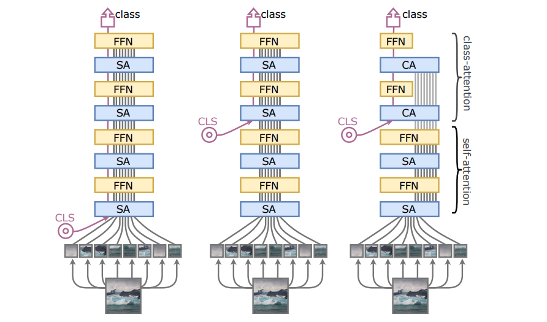

# Going deeper with Image Transformers

## 目录

- [1. 简介](#1)
- [2. 数据集和复现精度](#2)
- [3. 准备数据与环境](#3)
  - [3.1 准备环境](#3.1)
  - [3.2 准备数据](#3.2)
  - [3.3 准备模型](#3.3)
- [4. 开始使用](#4)
  - [4.1 模型训练](#4.1)
  - [4.2 模型评估](#4.2)
  - [4.3 模型预测](#4.3)
- [5. 模型推理部署](#5)
  - [5.1 模型导出](#5.1)
  - [5.2 基于Inference的推理](#5.1)
- [6. 自动化测试脚本](#6)
- [7. LICENSE](#7)
- [8. 参考链接与文献](#8)

<a id="1"></a>

## 1. 简介

CaiT利用了LayerScale，并提出了Class-Attention layers，表现SOTA！性能优于DeiT、TNT、ViT等网络。

- LayerScale 在每个残差块的输出上添加一个可学习的对角矩阵，添加这个简单的层可以提高训练的动态性，使我们能够训练更深层次的大容量 Transformer。
- Class-Attention 是一个类似于 Encode/Decode 的结构，和 Self-Attention 不同，Class-Attention 更注重从处理过的 patches token 中提取信息。
  

论文名称：[Going deeper with Image Transformers](https://arxiv.org/pdf/2103.17239.pdf)

参考代码：[https://github.com/facebookresearch/deit](https://github.com/facebookresearch/deit)

非常感谢朱欤老师的开源项目 [PaddleViT](https://github.com/BR-IDL/PaddleViT) 提供高性能的Transformer模型实现

AI Studio 快速体验：[https://aistudio.baidu.com/aistudio/projectdetail/3856073](https://aistudio.baidu.com/aistudio/projectdetail/3856073)

## 2. 数据集和复现精度

复现精度：ImageNet1k数据集上，XXS-24 model，top1 78.4%，top5 80.9%

数据集下载地址：[https://aistudio.baidu.com/aistudio/datasetdetail/122700](https://aistudio.baidu.com/aistudio/datasetdetail/122700)

```
#目录结构
dataset
    |---LSVRC2012
        |---train           #训练集
            |---XXXXX.jpg
            |---XXXXX.jpg
        |---valid
            |---XXXXX.jpg   #验证集
            |---XXXXX.jpg
        |1train_list.txt
        |1valid_list.txt
        |2train_list_shuffle.txt    #train乱序排列
        |2valid_list_shuffle.txt    #valid乱序排列
        |3train_list_shuffle_cut2.txt   #train数据量砍半
        |3valid_list_shuffle_cut2.txt   #valid数据量砍半
```

## 3. 准备数据与环境

### 3.1 准备环境

- 运行环境：尊享GPU A100 40GB
- 项目框架：PaddlePaddle 2.2.2

```
#安装配置库
!pip install yaml
!pip install yacs
!pip install reprod_log
```

```
# 安装auto_log
!git clone https://github.com/LDOUBLEV/AutoLog
%cd AutoLog/
!pip3 install -r requirements.txt
!python3 setup.py bdist_wheel
!pip3 install ./dist/auto_log-1.2.0-py3-none-any.whl
%cd ../
```

### 3.2 准备数据

数据集下载解压到`dataset`文件夹下

1、复制文件`txt/train_list.txt`到`dataset/LSVRC2012/train_list.txt`

2、复制文件`txt/val_list.txt`到`dataset/LSVRC2012/val_list.txt`

3、复制文件`txt/test_list.txt`到`dataset/LSVRC2012/test_list.txt`

### 3.3 准备模型

预训练模型`cait_xxs24_224.pdparams`下载至`CaiT/`文件夹下

百度网盘：[链接](https://pan.baidu.com/s/1uUQ33W0BuefkQoTFtAgCWQ )， 提取码：h00m

## 4. 开始使用

### 4.1 模型训练

```
!python CaiT/main_single_gpu.py  \
    -cfg='CaiT/configs/cait_xxs24_224.yaml'  \
    -dataset='imagenet2012' \
    -batch_size=256  \
    -pretrained='CaiT/cait_xxs24_224'  \
    -data_path='dataset/LSVRC2012'
```

日志记录：查看log_train.txt文件

```
0506 02:32:54 PM Now training epoch 100. LR=0.000000
0506 02:32:57 PM Epoch[100/100], Step[0000/0196], Avg Loss: 0.2471, Avg Acc: 0.9453
0506 02:34:26 PM Epoch[100/100], Step[0100/0196], Avg Loss: 0.2957, Avg Acc: 0.9359
0506 02:35:48 PM ----- Epoch[100/100], Train Loss: 0.2982, Train Acc: 0.9360, time: 173.40
```

### 4.2 模型评估

```
!python CaiT/main_single_gpu.py  \
    -cfg='CaiT/configs/cait_xxs24_224.yaml'  \
    -dataset='imagenet2012' \
    -batch_size=64  \
    -data_path='dataset/LSVRC2012'  \
    -pretrained='CaiT/cait_xxs24_224'  \
    -eval
```

日志记录：查看log_eval.txt文件

```
0506 02:40:28 PM Val Step[0000/0391], Avg Loss: 1.0674, Avg Acc@1: 0.7188, Avg Acc@5: 0.9219
0506 02:40:55 PM Val Step[0100/0391], Avg Loss: 0.8901, Avg Acc@1: 0.7848, Avg Acc@5: 0.9401
0506 02:41:23 PM Val Step[0200/0391], Avg Loss: 0.8867, Avg Acc@1: 0.7819, Avg Acc@5: 0.9408
0506 02:41:51 PM Val Step[0300/0391], Avg Loss: 0.8863, Avg Acc@1: 0.7841, Avg Acc@5: 0.9418
0506 02:42:17 PM Validation Loss: 0.8931, Validation Acc@1: 0.7834, Validation Acc@5: 0.9416, time: 111.96
```

### 4.3 模型预测

```
!python CaiT/main_single_gpu.py  \
    -cfg='CaiT/configs/cait_xxs24_224.yaml'  \
    -dataset='imagenet2012' \
    -batch_size=64  \
    -data_path='dataset/LSVRC2012'  \
    -pretrained='CaiT/cait_xxs24_224'  \
    -pred
```

'train/n02100877/n02100877_10277.JPEG'预测结果如下：

```
[Tensor(shape=[1], dtype=int64, place=CUDAPlace(0), stop_gradient=True, [213])]
```

## 5. 模型推理部署

### 5.1模型导出
```
!python CaiT/export_model.py
```

### 5.2 基于Inference的推理
```
!python CaiT/infer.py --img-path='dataset/LSVRC2012/train/n02100877/n02100877_10277.JPEG'
```
结果与4.3动态图推理一致：
```
image_name: data/LSVRC2012/train/n02100877/n02100877_10277.JPEG, class_id: 213, prob: 9.663969993591309
```

## 6. 自动化测试脚本
生成小样本数据集
```
!bash test_tipc/prepare.sh test_tipc/configs/CaiT/train_infer_python.txt 'lite_train_lite_infer'
```
训推一体化
```
!bash test_tipc/test_train_inference_python.sh test_tipc/configs/CaiT/train_infer_python.txt 'lite_train_lite_infer'
```
详细输出见`test_tipc`下的[readme.md]()
## 7. LICENSE

## 8. 参考链接与文献
